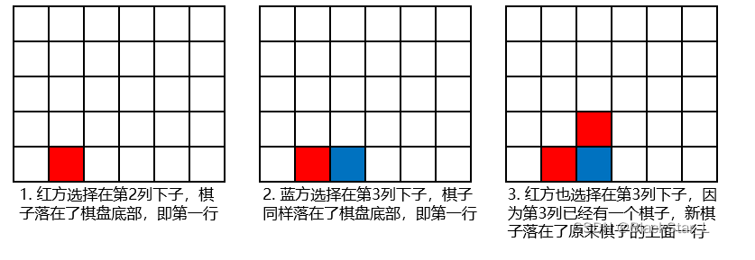

# 170 竖直四子棋

## 题目描述

竖直四子棋的棋盘是竖立起来的，双方轮流选择棋盘的—列下子，棋子因重力落到棋盘底部或者其他棋子之上，当一列的棋子放满时，无法再在这列上下子。—方的4个棋子横、竖或者斜方向连成—线时获胜。现给定一个棋盘和红蓝对弈双方的下子步骤，判断红方或蓝方是否在某一步获胜。下面以一个6 x 5的棋盘图示说明落子过程:



下面给出横、竖和斜方向四子连线的图示:


## 输入描述

输入为2行，第一行指定棋盘的宽和高，为空格分隔的两个数字

第二行依次间隔指定红蓝双方的落子步骤，第1步为红方的落子，第2步为蓝方的落子，第3步为红方的落子，以此类推。

步骤由空格分隔的一组数字表示，每个数字为落子的列的编号（最左边的列编号为1，往右递增)。用例保证数字均为32位有符号数。

## 输出描述

如果落子过程中红方获胜，输出 `N , red `

如果落子过程中蓝方获胜，输出 `N , blue `

如果出现非法的落子步骤，输出 `N , error `

`N`为落子步骤的序号，从`1`开始。如果双方都没有获胜，输出`0,draw` 
非法落子步骤有两种，一是列的编号超过棋盘范围，二是在一个已经落满子的列上落子。

`N`和单词`red` 、`blue` 、`draw` 、`error`之间是英文逗号连接。


## 示例描述

### 示例一

**输入：**

```text
5 5
1 1 2 2 3 3 4 4
```


**输出：**

```text
7,red
```

**说明：**

在第`7`步，红方在第`4`列落下一子后，红方的四个子在第一行连成一线，故红方获胜，输出 `7,red`


### 示例二

**输入：**

```text
5 5
0 1 2 2 3 3 4 4
```


**输出：**

```text
1,error
```

**说明：**

第`1`步的列序号为`0`，超出有效列编号的范围，故输出 `1, error`


## 解题思路

**基本思路：**

这道题是纯粹的的模拟题，可以直接按照题意上手模拟，但是如果我们能抽象和简化问题，思路会更清晰，代码逻辑也更简洁。

1. 不置换行和列，改变棋子下落方向
   开始给我们的行和列是相反的，因为模拟的是直角坐标系，其次棋子因为重力落在指定的x位置上垒起来。因为python中取一列需要for循环很麻烦，所以我们假设重力不是向下的而是向y轴落的，这样我们的行和列也不需要转变，每次下子取一行检查即可。
2. 每次落子判断
   两个判断：先判断是否合理，即落子超出范围或者溢出了；其次检查整个棋盘是否有四个方向的4子连珠。

## 解题代码

```python
def solve_method(s1, s2):
    # 检查是否规范，超出界限，或重溢出
    def check_valid(c):
        # 合法范围内
        if c not in [i+1 for i in range(row)]:
            return False
        # 已经满了，溢出
        if 0 not in board[c-1]:
            return False
        return True
    # 检查是否赢了
    def win(flag):
        color = 'red' if flag==1 else 'blue'
        # 竖，横，左对角线，右对角线
        directions = [(0, 1), (1, 0), (1, 1), (1, -1)]
        
        for i in range(row):
            for j in range(col):
                if board[i][j]==color:
                    for direction in directions:
                        dr, dc = direction
                        tmp_r, tmp_c = i, j
                        count=0
                        while 0<=tmp_r<row and 0<=tmp_c<col and board[tmp_r][tmp_c]==color:
                            count+=1
                            tmp_r+=dr
                            tmp_c+=dc
                        if count>=4:
                            return True
        return False
        
    # 行列不变，我们将棋子往y轴下坠
    row, col = list(map(int, s1.split()))
    board = [[0]*col for _ in range(row)]
    
    chess = list(map(int, s2.split()))
    flag = -1
    for ind, c in enumerate(chess):
        flag=-flag
        # 这一步落子是否有效，
        if check_valid(c):
            # 有效则添加棋子
            for i in range(col):
                if board[c-1][i]==0:
                    board[c-1][i]='red' if flag==1 else 'blue'
                    break
            # 如果放入这个棋子赢了，返回
            if win(flag):
                return str(ind+1)+',red' if flag==1 else str(ind+1)+',blue'
        else:
            return str(ind+1)+',error'
    return '0,draw'


if __name__ == '__main__':
    assert solve_method("5 5", "1 1 2 2 3 3 4 4") == '7,red'          # 横
    assert solve_method("5 5", "2 1 3 1 2 1 3 1") == '8,blue'         # 竖
    assert solve_method("5 5", "1 2 2 3 4 3 3 4 5 4 4 5") == '11,red' # 左对角
    assert solve_method("5 5", "5 4 4 3 2 3 3 2 1 2 2 1") == '11,red' # 右对角
    assert solve_method("5 5", "1 1 2 2 1 1 2 2") == '0,draw'         # 平局
    assert solve_method("5 5", "0 1 2 2 3 3 4 4") == '1,error'        # 超出范围
    assert solve_method("5 5", "1 2 2 2 2 2 2 4") == '7,error'        # 放置溢出
```


