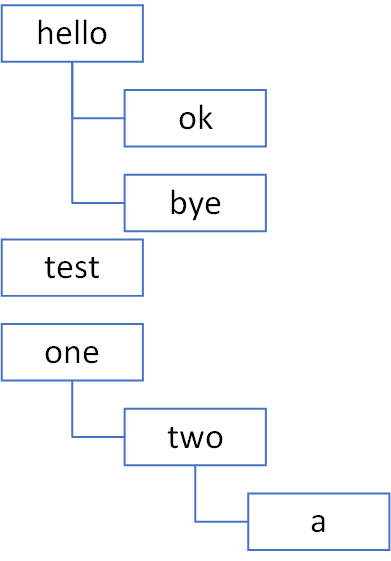

# 192 评论转换输出

## 题目描述

在一个博客网站上，每篇博客都有评论。每一条评论都是一个非空英文字母字符串。评论具有树状结构，除了根评论外，每个评论都有一个父评论。

当评论保存时，使用以下格式：
- 首先是评论的内容。
- 然后是回复当前评论的数量。
- 最后是当前评论的所有子评论。（子评论使用相同的格式嵌套存储）

所有元素之间都用单个逗号分隔。

第一条评论是`hello,2,ok,0,bye,0`，第二条评论是`test,0`，第三条评论是`one,1,two,1,a,0`。所有评论被保存成`hello,2,ok,0,bye,0,test,0,one,1,two,1,a,0`。

对于上述格式的评论，请以另外一种格式打印：
- 首先打印评论嵌套的最大深度。
- 然后是打印`n`行，第`i`行（1 <= i <= n）对应于嵌套级别为`i`的评论（根评论的嵌套级别为1）。对于第`i`行，嵌套级别为`i`的评论按照它们出现的顺序打印，用空格分隔。

## 输入描述

输入一行评论，规则如下：
- 由英文字母、数字和英文逗号组成。
- 保证每个评论都是由英文字符组成的非空字符串。
- 每个评论的数量都是整数（至少由一个数字组成）。
- 整个字符串的长度不超过106。
- 给定的评论结构保证是合法的。

## 输出描述

按照给定的格式打印评论。对于每一级嵌套，评论应该按照输入中的顺序打印。

## 示例描述

### 示例一

**输入：**

```text
hello,2,ok,0,bye,0,test,0,one,1,two,1,a,0
```

**输出：**

```text
3
hello test one
ok bye tow
a
```

**说明：**

如题目描述，最大嵌套级别为3：
- 嵌套级别为1的评论是`hello test one`。
- 嵌套级别为2的评论是`ok bye tow`。
- 嵌套级别为3的评论是`a`。



### 示例二

**输入：**

```text
A,5,A,0,a,0,A,0,a,0,A,0
```

**输出：**

```text
2
A
A a A a A
```

### 示例三

**输入：**

```text
A,3,B,2,C,0,D,1,E,0,F,1,G,0,H,1,I,1,J,0,K,1,L,0,M,2,N,0,O,1,P,0
```

**输出：**

```text
4
A K M
B F H L N O
C D G I P
E J
```

## 解题思路

1. `def ensure_level_exists(tree, level):`: 定义一个函数，用于确保树结构中存在给定的层级。如果当前树结构的层级少于要求的层级，会通过添加空的子列表来创建新的层级。
2. `def print_tree(tree):`: 定义打印树结构的函数。输出整个树的结构，首先输出树的层数，然后逐层输出各个节点。
3. `def recursive(nodes, level, child_count, tree):`: 定义递归构建树结构的函数。根据给定的节点列表、层级、子节点数量以及树结构，通过递归的方式构建整个树。
4. 在 `main()` 函数中：
   - `comments = input().split(",")`: 从输入读取一行评论，按逗号分割为评论列表。
   - 初始化一个空列表 `tree`，表示树的结构。
   - 将 `comments` 列表复制到 `nodes`，`nodes` 用于迭代构建树。
   - 初始化层级 `level` 为 1。
   - 使用一个循环，遍历 `nodes` 列表，逐步构建树结构。
     - 弹出一个评论作为当前节点 `comment`。
     - 调用 `ensure_level_exists(tree, level)`，确保树结构中存在当前层级。
     - 在当前层级 `level - 1` 中添加当前评论 `comment`。
     - 弹出一个整数，表示当前评论的子节点数量 `child_count`。
     - 调用 `recursive(nodes, level + 1, child_count, tree)`，根据子节点数量递归构建子树。
5. 最后，调用 `print_tree(tree)` 打印构建好的树结构。

## 解题代码

```python
def ensure_level_exists(tree,level):
    if len(tree) < level:
        tree.append([])


def print_tree(tree) :
    print(len (tree))
    for nodes in tree:
        print(" ".join (nodes) )
def recursive (nodes, level, child_count, tree) :
    for i in range (child_count):
        comment = nodes. pop(0)
        ensure_level_exists(tree,level)
        tree[level - 1 ].append(comment)
        count = int(nodes.pop(0))
        if count > 0:
            recursive(nodes, level + 1,count, tree)


def main():
    comments = input().split(",")

    tree = []
    nodes = comments.copy()

    level = 1
    while nodes:
        comment = nodes.pop(0)
        ensure_level_exists(tree, level)
        tree[level - 1].append(comment)
        child_count = int(nodes.pop(0))
        recursive(nodes, level + 1, child_count, tree)

    print_tree(tree)

main()
```

