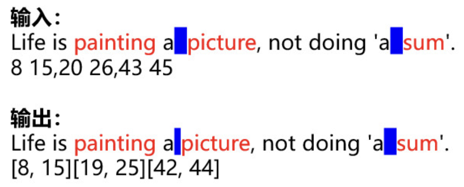

# 232 去除多余空格

## 题目描述
去除文本多余空格，但不去除配对单引号之间的多余空格。给出关键词的起始和结束下标，去除多余空格后刷新关键词的起始和结束下标。

条件约束：


1. 不考虑关键词起始和结束位置为空格的场景；
2. 单词的的开始和结束下标保证涵盖一个完整的单词，即一个坐标对开始和结束下标之间不会有多余的空格；
3. 如果有单引号，则用例保证单引号成对出现；
4. 关键词可能会重复；
5. 文本字符长度`length`取值范围：`[0, 100000]`;

## 输入描述
输入为两行字符串：

第一行：待去除多余空格的文本，用例保证如果有单引号，则单引号成对出现，且单引号可能有多对。

第二行：关键词的开始和结束坐标，关键词间以逗号区分，关键词内的开始和结束位置以单空格区分。

例如：
```
Life is painting a  picture, not doing 'a  sum'.
8 15,20 26,43 45
```

关键单词为：`painting` `picture` `sum`

## 输出描述
输出为两行字符串：

第一行：去除多余空格后的文本

第二行：去除多余空格后的关键词的坐标开始和结束位置，为数组方式输出。

例如：
```
Life is painting a picture, not doing 'a  sum'.
[8, 15][19, 25][42, 44]
```

## 示例描述

### 示例一

**输入：**
```
Life is painting a  picture, not doing 'a  sum'.
8 15,20 26,43 45
```

**输出：**
```
Life is painting a picture, not doing 'a  sum'.
[8, 15][19, 25][42, 44]
```

**说明：** 
a 和 picture 中间多余的空格进行删除

### 示例二

**输入：**
```
Life is painting a picture, not doing 'a  sum'.
8 15,19 25,42 44
```

**输出：**
```
Life is painting a picture, not doing 'a  sum'.
[8, 15][19, 25][42, 44]
```

**说明：** 
`a` 和 `sum` 之间有多余的空格，但是因为有成对单引号，不去除多余空格

## 解题思路
**简单提示**
根据题目要求，删除多余空格，并将删除的空格下标记录下来，再遍历重新计算关键词的坐标 

## 解题代码
``` python
def solve_method(text, keyLocation):
    # 删除需text要处理的多余空格,并记录index
    words = text.split(' ')
    textRes = ""
    spaces_index = []
    idx = 0

    # 删除多余空格
    for item in words:
        if item == '':
            spaces_index.extend(idx)
        else:
            textRes += item + ' '
            idx += len(item) + 1

    # 根据删除空格的index，计算新的关键词坐标
    
    return False

def transKeyLocation(keyWordsIdx):
    keyWordsIdx  = keyWordsIdx.split(',')

    res = []
    for idxs in keyWordsIdx:
        res.extend(int(n) for n in idxs.split(' '))
    return res

if __name__ == '__main__':
    text = "Life is painting a  picture, not doing 'a  sum'."
    keyWordsIdx = "8 15,20 26,43 45"
    keyWordsIdx = transKeyLocation(keyWordsIdx)

    textRes = "Life is painting a picture, not doing 'a  sum'."
    keyWordsIdxRes = [[8, 15], [19, 25], [42, 44]]

    assert solve_method(text, keyWordsIdx) == (textRes, keyWordsIdxRes)

    text = "Life is painting a picture, not doing 'a  sum'."
    keyWordsIdx = "8 15,19 25,42 44"
    keyWordsIdx = transKeyLocation(keyWordsIdx)

    textRes = "Life is painting a picture, not doing 'a  sum'."
    keyWordsIdxRes = [[8, 15], [19, 25], [42, 44]]

    assert solve_method(text, keyWordsIdx) == (textRes, keyWordsIdxRes)
```