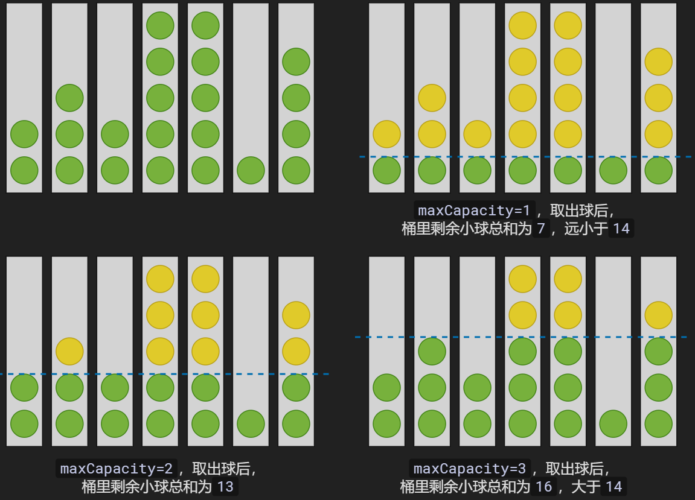

# 238 开放日活动

## 题目描述
某部门开展Family Day开放日活动，其中有个从桶里取球的游戏，游戏规则如下：

有 `N` 个容量一样的小桶等距排开，

且每个小桶都默认装了数量不等的小球，

每个小桶装的小球数量记录在数组 `bucketBallNums` 中，

游戏开始时，要求所有桶的小球总数不能超过 `SUM`，

如果小球总数超过SUM，则需对所有的小桶统一设置一个容量最大值 `maxCapacity`，

并需将超过容量最大值的小球拿出来，直至小桶里的小球数量小于 `maxCapacity`;

请您根据输入的数据，计算从每个小桶里拿出的小球数量。

限制规则一：

所有所有小桶的小球总和小于 `SUM`，则无需设置容量值，

并且无需从小桶中拿球出来，返回结果 `[]`;

限制规则二：

如果所有小桶的小球总和大于 `SUM`，则需设置容量最大值 `maxCapacity`，

并且需从小桶中拿球出来，返回从每个小桶拿出的小球数量组成的数组；

## 输入描述
第一行输入 `2` 个正整数，数字之间使用空格隔开，其中第一个数字表示 `SUM`，第二个数字表示 `bucketBallNums` 数组长度；

第二行输入 `N` 个正整数，数字之间使用空格隔开，表示 `bucketBallNums` 的每一项；

## 输出描述
输出从每个小桶里拿出的小球数量组成的数组；

## 示例描述

### 示例一

**输入：**
```
14 7
2 3 2 5 5 1 4
```

**输出：**
```
[0,1,0,3,3,0,2]
```

**说明：** 
小球总数为 `22`，`SUM=14`，超出范围了，需从小桶取球，

`maxCapacity=1`，取出球后，桶里剩余小球总和为 `7`，远小于 `14`

`maxCapacity=2`，取出球后，桶里剩余小球总和为 `13`，

`maxCapacity=3`，取出球后，桶里剩余小球总和为 `16`，大于 `14`

因此 `maxCapacity为2` ，每个小桶小球数量大于 `2` 的都需要拿出来；



### 示例二

**输入：**
```
3 3
1 2 3
```

**输出：**
```
[0,1,2]
```

**说明：** 
小球总数为`6`，`SUM=3`，超出范围了，需从小桶取球

`maxCapacity=1`，则小球总数为`3`，

从 `0` 号桶取出 `0` 个球，

从 `1` 号桶取出 `1` 个球，

从 `2` 号桶取出 `2` 个球；

### 示例三

**输入：**
```
6 2
3 2
```

**输出：**
```
[]
```

**说明：** 
小球总数为 `5`，`SUM=6`，在范围内，无需从小桶取球；

## 备注
$1 \leq bucketBallNums[i] \leq 10^9$

$1 \leq bucketBallNums.length = N \leq 10^5$

$1 \leq maxCapacity \leq 10^9$

$1 \leq SUM \leq 10^9$

## 解题代码
``` python
def solve_method(target_sum, bucket_balls):
    total = sum(bucket_balls)
    if total <= target_sum:
        # 整体小球总数未超过范围
        return []
    
    tmp = [0] * len(bucket_balls)
    sub = [0] * len(bucket_balls)

    for i in range(target_sum, 0, -1):
        for k in range(len(bucket_balls)):
            # 进行取球尝试
            sub[k] = bucket_balls[k] - i if bucket_balls[k] - i > 0 else 0
            tmp[k] = i if bucket_balls[k] - i > 0 else bucket_balls[k]
        if sum(tmp) <= target_sum:
            # 达到要求即可返回
            return sub

if __name__ == '__main__':
    bucket_balls = [2,3,2,5,5,1,4]
    assert solve_method(14, bucket_balls) == [0, 1, 0, 3, 3, 0, 2]

    bucket_balls = [1, 2, 3]
    assert solve_method(3, bucket_balls) == [0, 1, 2]

    bucket_balls = [3, 2]
    assert solve_method(6, bucket_balls) == []
```