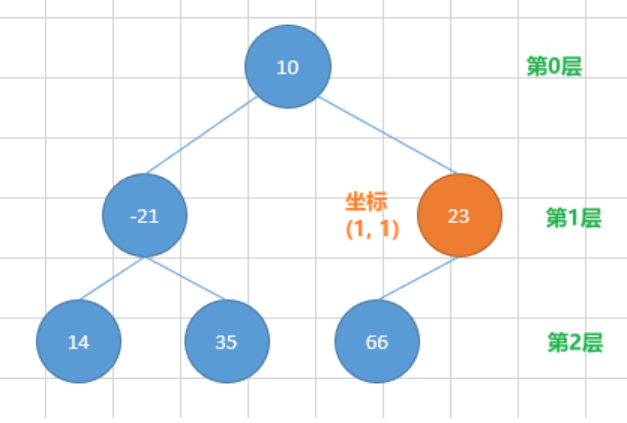

# 253 查找树中的元素、查找二叉树节点

## 题目描述

已知树形结构的所有节点信息，现要求根据输入坐标`(x,y)`找到该节点保存的内容值，其中：
- `x`表示节点所在的层数，根节点位于第0层，根节点的子节点位于第1层，依次类推；
- `y`表示节点在该层内的相对偏移，从左至右，第一个节点偏移0，第二个节点偏移1，依次类推；



举例：上图中，假定圆圈内的数字表示节点保存的内容值。则上根据坐标`(1,1)`，查询输出`{23}`。


## 输入描述

每个节点以一维数组（`int[]`）表示，所有节点信息构成二维数组（`int[][]`），二维数组的0位置存放根节点，表示单节点的一维数组中，0位置保存内容值，后续位置保存子节点在二维数组中的索引位置。

对于上图中：
- 根节点可以表示为`{10,1,2}`
- 树的整体表示为`{{10,1,2},{-21,3,4},{23,5},{14},{35},{66}}` 

使用标准IO键盘输入进行录入时，先录入节点数量，然后逐行录入节点，最后录入查询的位置，对于上述示例为：
```text
6
10 1 2
-21 3 4
23 5
14
35
66
1 1
```

## 输出描述

查询到内容值时，输出`{内容值}`，查询不到时输出`{}`。

根据坐标`(1,1)`，查询输出`{23}`。

**补充说明：**

考试者不需要自己编写解析输入文本的代码，请直接使用上述代码中的Parser类解析输入文本。

数组`s`满足：1 <= length(s) <= 1000。

## 示例描述

### 示例一

**输入：**
```text
6
10 1 2
-21 3 4
23 5
14
35
66
1 1
```

**输出：**
```text
{23}
```

### 示例二

**输入：**
```text
14
0 1 2 3 4
-11 5 6 7 8
113 9 10 11
24 12
35
66 13
77
88
99
101
102
103
25
104
2 5
```

**输出：**
```text
{102}
```

## 解题思路

**基本思路：** 使用广度优先搜索BFS求解。

1. 使用广度优先搜索，得到`x`层的所有数字：
   - 确定参数：节点表示数组`nodes`, 数字的索引`index`, 所在的层次`depth`, 该层的数字列表`res`。
   - 终止条件：如果到达叶子节点，直接返回该层的数字列表。
   - 递归处理：遍历当前层所有的节点。
2. 返回该层的偏移量为`y`的数字。   

## 解题代码
```python
def solve_method(nodes, pos):
    # 得到满足层数要求的所有节点，节点的索引即为其偏移
    x, y = pos
    res = []
    get_nodes_by_depth(nodes, 0, x, res)
    # 得到满足偏移的节点
    if y > len(res):
        return "{}"
    return "{" + str(res[y]) + "}"


def get_nodes_by_depth(nodes, index, depth, res):
    # 索引index处的节点，node的取值为{节点值，子节点索引1,...}
    node = nodes[index]
    if depth == 0:
        res.append(node[0])
        return res
    # 到达叶子节点
    if len(node) == 1:
        return res
    for i in node[1:]:
        get_nodes_by_depth(nodes, i, depth - 1, res)


if __name__ == "__main__":
    # num = int(input().strip())
    # nodes = []
    # for _ in range(num):
    #     nodes.append(list(map(int, input().strip().split())))
    # x, y = map(int, input().strip().split())
    # print(solve_method(nodes, x, y))

    arr = [[10, 1, 2],
           [-21, 3, 4],
           [23, 5],
           [14],
           [35],
           [66]]
    assert solve_method(arr, (1, 1)) == "{23}"

    arr = [[0, 1, 2, 3, 4],
           [-11, 5, 6, 7, 8],
           [113, 9, 10, 11],
           [24, 12],
           [35],
           [66, 13],
           [77],
           [88],
           [99],
           [101],
           [102],
           [103],
           [25],
           [104]]
    assert solve_method(arr, (2, 5)) == "{102}"
```