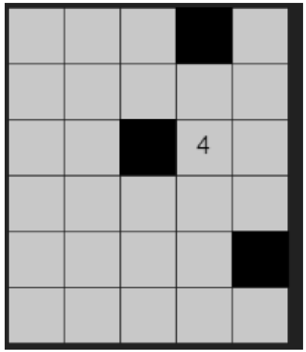
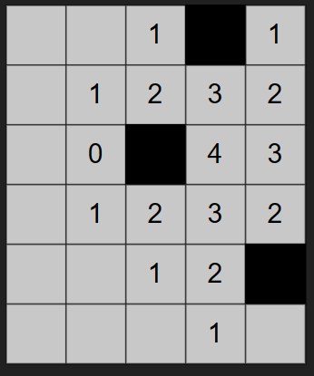

https://wiki.amoscloud.com/zh/ProgramingPractice/NowCoder/Adecco/Topic0156

# 263 计算网络信号

## 题目描述

网络信号经过传递会逐层衰减，且遇到阻隔物无法直接穿透，在此情况下需要计算某个位置的网络信号值。

> 注意：网络信号可以绕过阻隔物

- array[m][n]的二维数组代表网格地图，
- array[i][j]＝0代表i行j列是空旷位置；
- array[i][j]＝x（x为正整数）代表i行j列是信号源，信号强度是x；
- array[i][j]＝-1代表i行j列是阻隔物．
- 信号源只有1个，阻隔物可能有0个或多个
- 网络信号衰减是上下左右相邻的网格衰减1
- 现要求输出对应位置的网络信号值。

## 输入描述

输入为三行，第一行为m、n，代表输入是一个mxn的数组。

第二行是一串mxn如个用空格分隔的整数。

  - 每连续n个数代表一行，再往后n个代表下一行，以此类推。
  - 对应的值代表对应的网格是空矿位置，还是信号源，还是阻隔物。

第三行是i、j，代表需要计算 array[i][j]的网络信号值。

注意：此处i和j均从0开始，即第一行i为0

例如
```
6 5
0 0 0 -1 0 0 0 0 0 0 0 0 -1 4 0 0 0 0 0 0 0 0 0 0 -1 0 0 0 0 0
1 4
```

代表如下地图


需要输出第1行第4列的网络信号值，如下图，值为2


## 输出描述

输出对应位置的网络信号值，如果网络信号未覆盖到，也输出0。

一个网格如果可以途径不同的传播衰减路径传达，取较大的值作为其信号值。

## 示例描述

### 示例一

**输入：**
```text
6 5
0 0 0 -1 0 0 0 0 0 0 0 0 -1 4 0 0 0 0 0 0 0 0 0 0 -1 0 0 0 0 0
1 4 
```

**输出：**
```text
2
```

### 示例二

**输入：**
```text
6 5
0 0 0 -1 0 0 0 0 0 0 0 0 -1 4 0 0 0 0 0 0 0 0 0 0 -1 0 0 0 0 0
2 1 
```

**输出：**
```text
0 
```

### 备注

```text
1．m不一定等于n，m＜100，n＜100，网络信号之小于1000
2．信号源只有1个，阻隔物可能有0个或多个。
3．输入的m，n与第二行的数组是合法的，无需处理数量对不上的异常情况。
4．要求输出信号值的位置，不会是阻隔物。 
```

## 解题思路

**基本思路：**

..

**代码思路：**
1. .
2. .
3. .

## 解题代码
```python
def solve_method(s, t, a, b):
    #

if __name__ == "__main__":
    s, t, a, b = map(int, input().split())  
    print(solve_method(s, t, a, b))
    assert solve_method(1, 10, 5, 2) == 1
    assert solve_method(11, 33, 4, 10) == 2
```